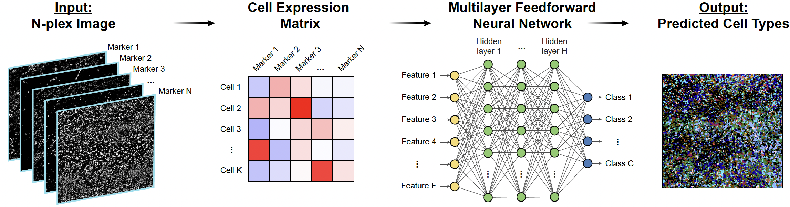

MAPS: Machine learning for Analysis of Proteomics in Spatial biology 
===========


**Pathologist-level cell type annotation from tissue images through machine learning**
<br>
*TL;DR: Highly multiplexed protein imaging is emerging as a potent technique for analyzing protein distribution within cells and tissues in their native context. However, existing cell annotation methods utilizing high-plex spatial proteomics data are resource intensive and necessitate iterative expert input, thereby constraining their scalability and practicality for extensive datasets. We introduce **MAPS** (Machine learning for Analysis of Proteomics in Spatial biology), a machine learning approach facilitating rapid and precise cell type identification with human-level accuracy from spatial proteomics data. Validated on multiple in-house and publicly available MIBI and CODEX datasets, MAPS outperforms current annotation techniques in terms of speed and accuracy, achieving pathologist-level precision even for typically challenging cell types, including tumor cells of immune origin. By democratizing rapidly deployable and scalable machine learning annotation, MAPS holds significant potential to expedite advances in tissue biology and disease comprehension.*

Check out our preprint here: https://www.biorxiv.org/content/10.1101/2023.06.25.546474v1

© This code is made available for non-commercial academic purposes. 


# Installation
## Pre-requisites
* Python (3.9.0)
* PyTorch (1.13.1)
* Numpy (1.12.5)
* Pandas (1.5.5)
* Scikit-Learn (1.2.1)
* Mlxtend (0.22.0)
* Setuptools (63.4.1)

## Virtual Environment (Optional)
### Using Anaconda
``` shell
conda create -n maps python=3.9.0
conda activate maps
```
### Using Python
``` shell
# for Unix/macOS
python3 -m pip install --user virtualenv
python3 -m venv maps
source maps/bin/activate

# for Windows
py -m venv maps
.\maps\Scripts\activate
```
## Remote Installation (Recommended)
``` shell
pip install git+git://github.com/mahmoodlab/MAPS.git#egg=maps
```
## Local Installation
``` shell
git clone https://github.com/mahmoodlab/MAPS.git
pip install -e ./MAPS
```

## Development Mode
``` shell
git clone https://github.com/mahmoodlab/MAPS.git
pip install -r ./MAPS/requirements.txt
```


# Datasets
Datasets are expected to be prepared in a CSV format containing at least **N+1** columns where **N** is the number of marker in the given dataset and the one additional column is for cell size. Each row of the CSV file should represent marker expression for a given cell along with cell size. To retrain cell phenotyping on new dataset, split the dataset into train and valid CSV files and add an extra column 'cell_label' (numerical, e.g. 0, 1, 2...., instead of strings such as 'CD4 T cell', 'CD8 T cell' etc.) in both train and valid CSV files to provide the ground truth(class id) for each cell, see sample train and valid CSV files under data/cell_phenotyping directory.


# Tutorial
In the tutorial directory, a detailed tutorial on how to use the MAPS package is provided in the form of a Jupyter Notebook file named [cell_phenotyping.ipynb](https://github.com/mahmoodlab/MAPS/blob/main/tutorial/cell_phenotyping.ipynb). A brief demonstration of how to use the MAPS package to train a new model and to use a trained model for prediction on new datasets is provided below.

## Training
The cell_phenotyping module in MAPS package provides a Trainer class that can be used to train a new cell phenotyping model. The Trainer class takes several hyperparameters, such as the number of features in the input data, the number of classes to be predicted, the batch size for training, the maximum number of epochs to train, and the minimum number of epochs to train. Additionally, the Trainer class takes the paths to the CSV files containing the training and validation data. Both CSV files should have ground truth labels for each cell under 'cell_lable' column.

Following code can be used to train a new cell phenotyping model:


``` python
from maps.cell_phenotyping import Trainer

results_dir = '../results/cell_phenotyping/'
train_data_path = '../data/cell_phenotyping/train.csv'
valid_data_path = '../data/cell_phenotyping/valid.csv'

model = Trainer(results_dir=results_dir, num_features=50, num_classes=16, batch_size=128, max_epochs=500, min_epochs=250, patience=100, verbose=0)
model.fit(train_data_path, valid_data_path)
```

## Prediction
Once the cell phenotyping model has been trained using the Trainer class, the trained model can be used to make predictions on new data using the Predictor class. The Predictor class takes several hyperparameters, such as the number of features in the input data, the number of classes to be predicted, and the batch size for prediction. Additionally, the Predictor class takes the path to the checkpoint file containing the trained model parameters.

Following code can be used to make predictions using the trained model:

``` python
from maps.cell_phenotyping import Predictor

pretrained_model_checkpoint_path = '../results/cell_phenotyping/best_checkpoint.pt'
data_path = '../data/cell_phenotyping/valid.csv'

model = Predictor(model_checkpoint_path=pretrained_model_checkpoint_path, num_features=50, num_classes=16, batch_size=128)
pred_labels, pred_probs = model.predict(data_path)
```

# Issues
- Please report all issues on the public forum.

# License
© This code is made available under the Commons Clasuse License and is available for non-commercial academic purposes.
<!-- 
## Reference
If you find our work useful in your research or if you use parts of this code please consider citing our paper:

Lu, M.Y., Chen, T.Y., Williamson, D.F.K. et al. AI-based pathology predicts origins for cancers of unknown primary. Nature 594, 106–110 (2021). https://doi.org/10.1038/s41586-021-03512-4

```
@article{lu2021ai,
  title={AI-based pathology predicts origins for cancers of unknown primary},
  author={Lu, Ming Y and Chen, Tiffany Y and Williamson, Drew FK and Zhao, Melissa and Shady, Maha and Lipkova, Jana and Mahmood, Faisal},
  journal={Nature},
  volume={594},
  number={7861},
  pages={106--110},
  year={2021},
  publisher={Nature Publishing Group}
}
```
-->
